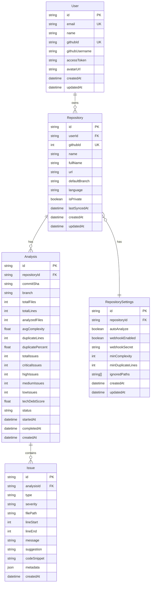

# DevFlow - Technical Debt Tracking Platform

**DevFlow** is a comprehensive code analysis platform that automatically scans GitHub repositories to detect code quality issues, technical debt, and potential improvements. It provides developers with actionable insights through an intuitive dashboard, helping teams maintain high code quality standards and make informed refactoring decisions.

## Problem Statement

Modern software development faces several critical challenges:

- **Invisible Technical Debt**: Teams often don't realize how much technical debt accumulates until it becomes critical
- **Manual Code Reviews are Time-Consuming**: Identifying code smells, duplicates, and complexity issues manually is inefficient
- **Lack of Metrics**: Without quantifiable metrics, it's hard to prioritize refactoring efforts
- **No Historical Tracking**: Teams can't easily see if code quality is improving or degrading over time
- **Scattered Tools**: Developers need to use multiple separate tools for different analysis types

## Key Features

- **Cyclomatic Complexity Detection**: Identify overly complex functions that need refactoring
- **Duplicate Code Finder**: Locate code duplication across your codebase using advanced algorithms
- **Code Smells Detection**: Recognize anti-patterns like long functions, god classes, and deep nesting
- **Dependency Analysis**: Visualize module dependencies and identify coupling issues

## Analytics & Reporting

- **Technical Debt Score**: Aggregate metric (0-100) representing overall code health
- **Trend Charts**: Visualize how code quality changes over time
- **File Heatmap**: Identify the most problematic files in your codebase
- **Issue Prioritization**: Focus on high-impact problems first

## Integrations

- **GitHub OAuth**: Seamless authentication and repository access
- **PR Comments**: Automated feedback on pull requests (future feature)
- **Badge Generation**: Display your code quality score in README

## User Experience

- **Interactive Code Viewer**: Browse code with highlighted issues
- **Diff Comparison**: See how issues changed between analyses
- **Filtering & Search**: Quickly find specific types of issues
- **Export Reports**: Generate PDF/JSON reports

## Technology Stack

### - Frontend

- **Next.js 16** (App Router)
- **TypeScript** - Type-safe development
- **Tailwind CSS** - Utility-first styling
- **Recharts** - Data visualization
- **shadcn/ui** - Modern UI components

### - Backend

- **Next.js API Routes** - Serverless API endpoints
- **Prisma ORM** - Type-safe database access
- **PostgreSQL** - Database

### Authentication & APIs

- **NextAuth.js** - GitHub OAuth implementation
- **GitHub REST API** - Repository data access
- **Octokit** - GitHub API client

### DevOps & Quality

- **GitHub Actions** - CI/CD automation
- **Vercel** - Deployment platform
- **ESLint + Prettier** - Code quality and formatting
- **Jest** - Unit and E2E testing
- **Husky** - Git hooks for quality gates

## CI/CD Setup

This project includes a GitHub Actions CI workflow that automatically runs on pull requests and pushes to main branches. The CI pipeline checks:

- **Code Formatting** - Ensures code follows Prettier formatting rules
- **Linting** - Runs ESLint to catch code quality issues
- **Build** - Ensures the project builds successfully
- **Tests** - Runs unit, integration, and UI tests

### Prerequisites

- Node.js 20+ and npm
- GitHub account
- Git

### Component Diagram

### ER Diagram

## Team

**Solo Developer** - Plyako Nikita

- GitHub: [@ITNIKITAIT](https://github.com/ITNIKITAIT)
